# 3482450 README

This readme is related to marking. See readme in src for lanch instructions.

## node version:

USING NODE: V17.6.0

standard React npm install /start to run app on port /3000 - see readme in src react folder.

# assignment 2 work

all branches on A2/BRANCHNAME are work related to assignment 2

commit for folder restructure marked "BEGIN ASSIGNMENT 2 COMMITS" on main marks the start of assignment 2 work (October 4th)

UPDATE: I have since deleted all the branches from Assignment 1 for clarity of marking in Assignment 2.

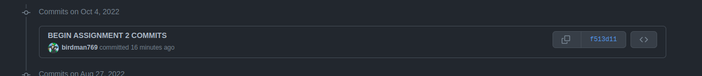

# referencing and sources

I have been careful to reference where I got my material from. I have included links to my REGEX sources for the login and registration above where they are delcared.

Apart from a date conversion(referenced in Profile.js), The only other material used/referenced is the RMIT-FWP WEEK 8 lab. I have included a note that this lab is also used in the related files.

It was primarily used as a starter base for the back end and getting up and running with the Posts and the User models.

# Server/express

To Setup the server-

cd into the express directory then run from terminal:

`npm install`

To Run:

`node server.js`

# React App front end

To Setup the React frontend:

cd into the React directory then run from terminal:

`npm install`

To Run:

`npm start`

# React App front end unit Testing

cd into the React directory then run from terminal:

`npm test`

In Regards to the testing here- my implementation is not the best.

I have working Tests for the registration form and the login form.

I however could not get around issues of test running endlessly due to the API calls in other files(I could not figure out in time how to mock this.)

As a result I have tests for the Profile Editing and the Post Page- however these tests are commented out. I have included them to show my attempt but they are commented out as they endlessly run

# React App Screenshots

## Landing page

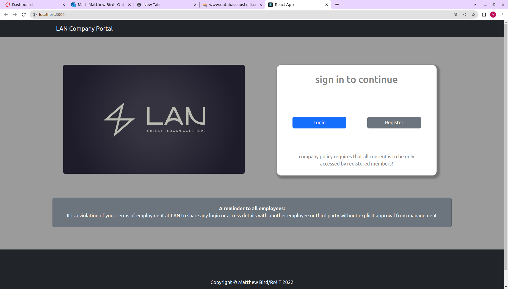

## register

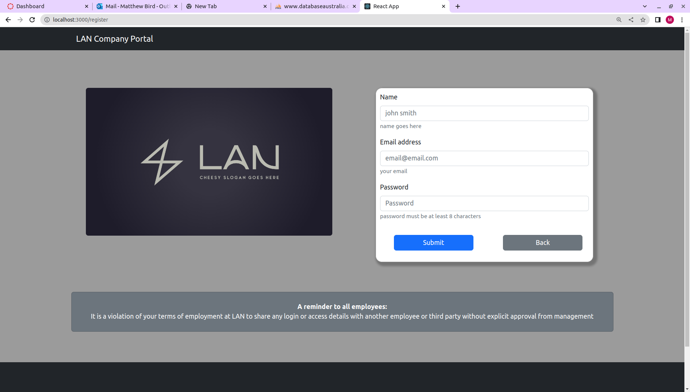

## login

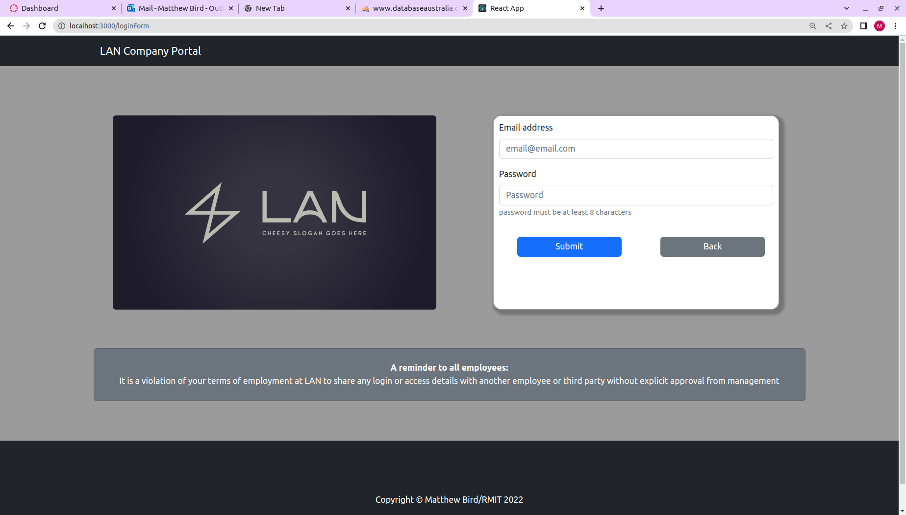

## profile

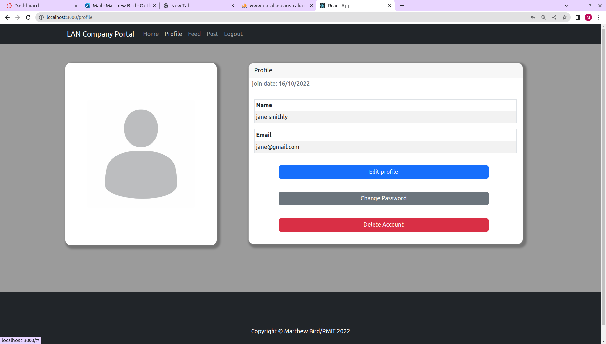

## profile-edit

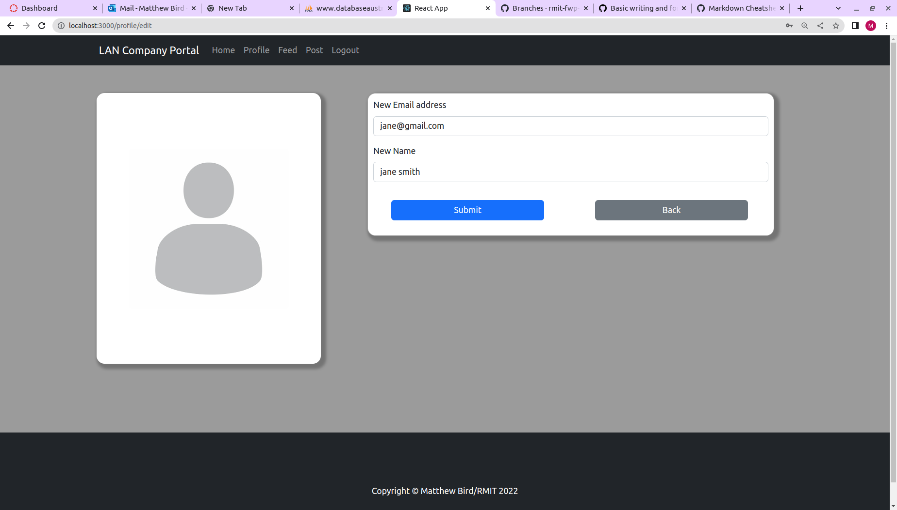

## profile-password

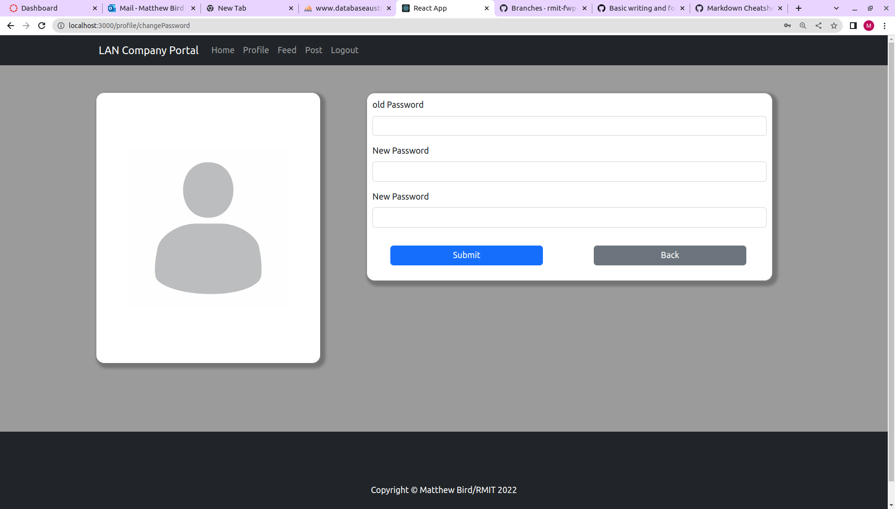

## profile-delete

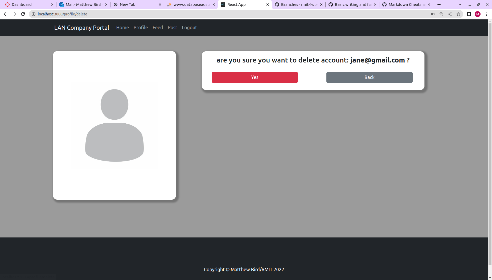

## feed

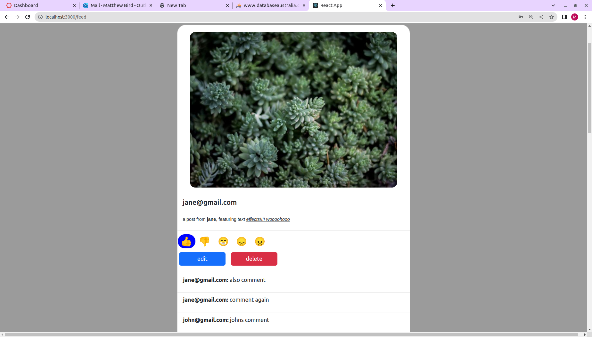

## feed- edit post

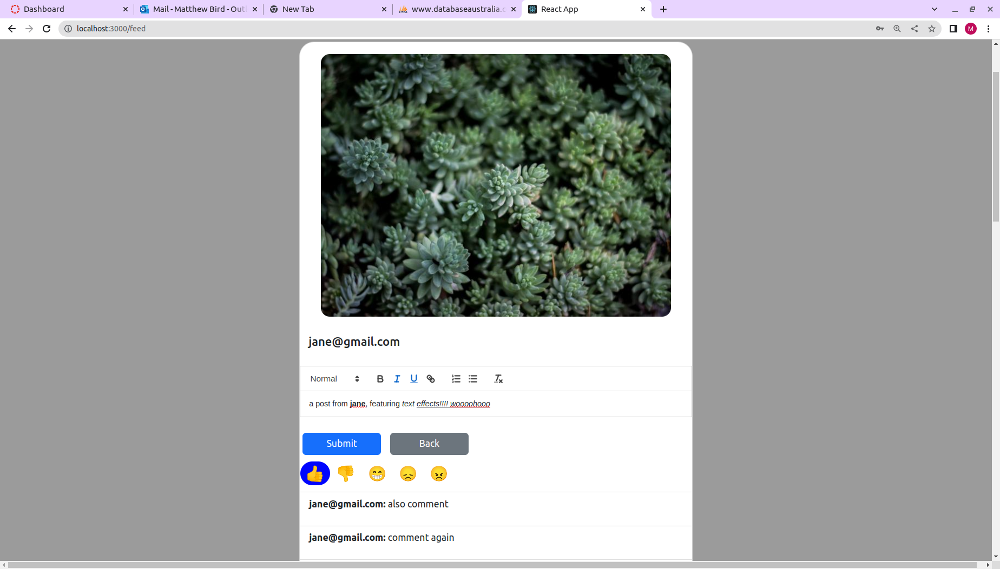

## make post

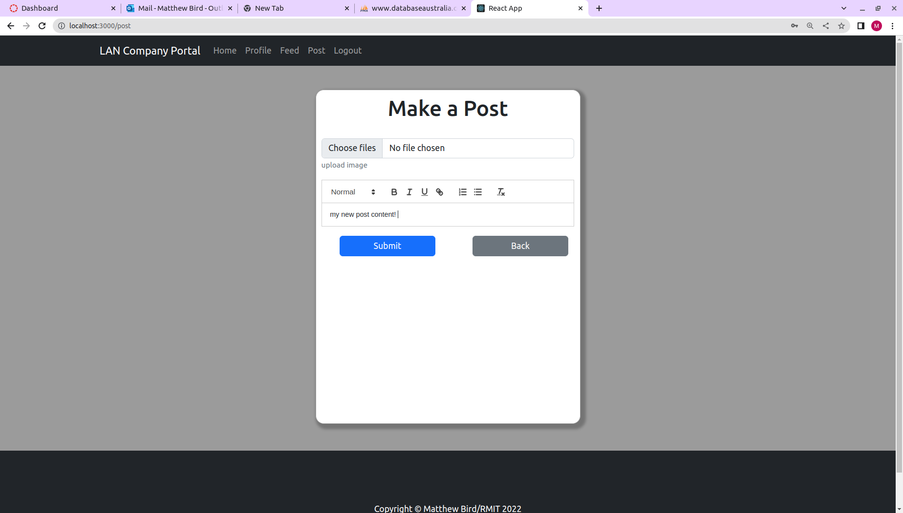
